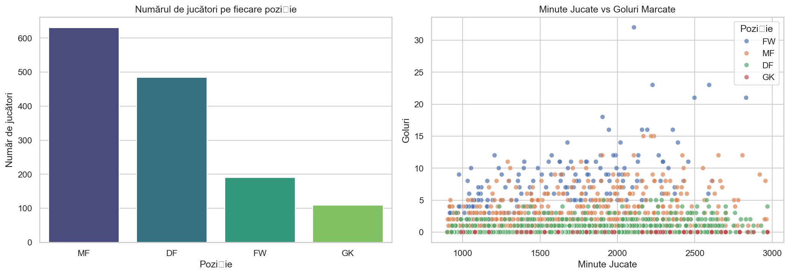
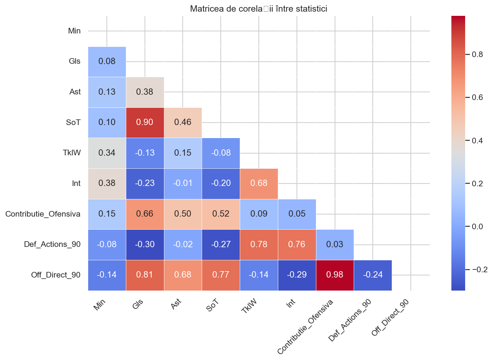
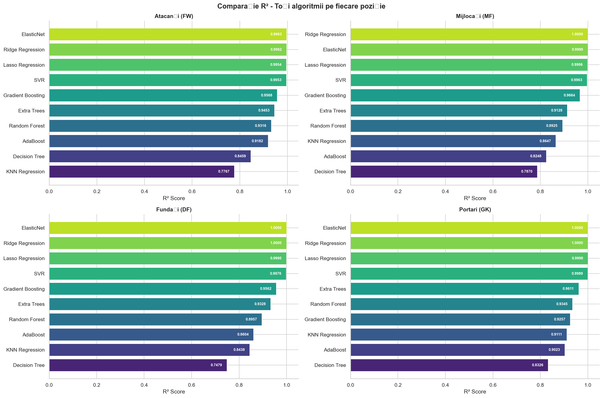
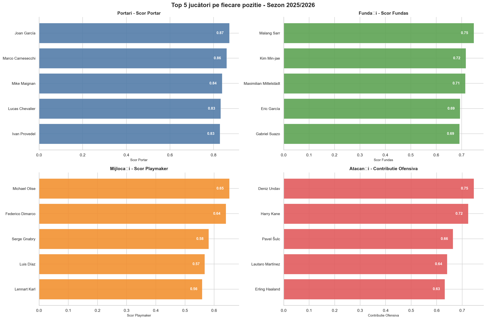
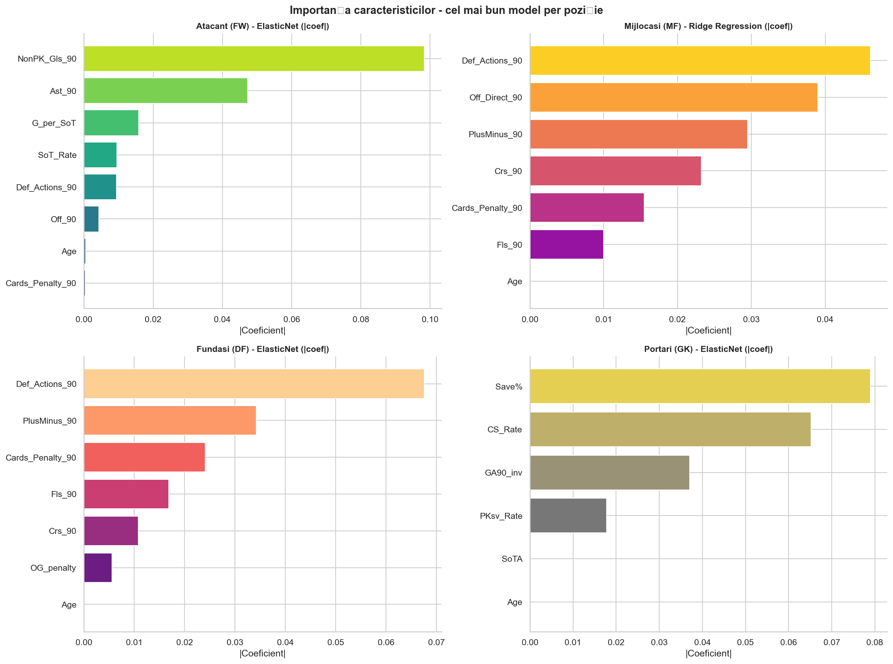

# Analiza Performantei Jucatorilor de Fotbal – Sezon 2025/2026

> **Documentatie Proiect – Invatare Automata**  
> Facultatea de Informatica / Data Science | Anul III, Semestrul II – 2026

---

## Cuprins

1. [Sursa datelor](#1-sursa-datelor)
2. [Introducere si Motivatie](#2-introducere-si-motivatie)
3. [Descrierea Datelor si Contextul Proiectului](#3-descrierea-datelor-si-contextul-proiectului)
   - 3.1 [Setul de date](#31-setul-de-date)
   - 3.2 [Curatarea datelor](#32-curatarea-datelor)
   - 3.3 [Ce incearca sa rezolve proiectul](#33-ce-incearca-sa-rezolve-proiectul)
4. [Aspecte Teoretice](#4-aspecte-teoretice)
   - 4.1 [De ce regresie supervizata?](#41-de-ce-regresie-supervizata)
   - 4.2 [Algoritmii folositi](#42-algoritmii-folositi)
   - 4.3 [Scorul compozit de performanta](#43-scorul-compozit-de-performanta)
5. [Implementarea](#5-implementarea)
   - 5.1 [Fluxul de lucru](#51-fluxul-de-lucru)
   - 5.2 [Impartirea datelor](#52-impartirea-datelor)
   - 5.3 [Optimizarea hiperparametrilor](#53-optimizarea-hiperparametrilor)
6. [Testare si Validare](#6-testare-si-validare)
   - 6.1 [Metricile de evaluare](#61-metricile-de-evaluare)
   - 6.2 [Rezultatele comparative](#62-rezultatele-comparative)
7. [Rezultate si Discutii](#7-rezultate-si-discutii)
   - 7.1 [Topul jucatorilor per pozitie](#71-topul-jucatorilor-per-pozitie)
   - 7.2 [Unde greseste modelul?](#72-unde-greseste-modelul)
   - 7.3 [Explicabilitatea modelului](#73-explicabilitatea-modelului-feature-importance)
8. [Concluzii si Cunostinte Noi](#8-concluzii-si-cunostinte-noi)
9. [Referinte](#9-referinte)
10. [Structura Proiectului](#10-structura-proiectului)
11. [Tehnologii Utilizate](#11-tehnologii-utilizate)

---

## 1. Sursa datelor

| Camp | Detalii |
|------|---------|
| **Dataset** | Football Players Stats 2025-2026 |
| **Sursa** | [Kaggle – hubertsidorowicz/football-players-stats-2025-2026](https://www.kaggle.com/datasets/hubertsidorowicz/football-players-stats-2025-2026) |
| **Data descarcarii** | 24 martie 2026 |
| **Campionate acoperite** | Premier League, La Liga, Serie A, Bundesliga, Ligue 1 |
| **Nr. jucatori (brut)** | ~2.800 |
| **Nr. jucatori (dupa curatare)** | ~1.900 |
| **Nr. caracteristici (dupa curatare)** | ~60–70 per jucator |

---

## 2. Introducere si Motivatie

Oricine urmareste fotbal cu ceva mai multa atentie a ajuns la un moment dat la concluzia ca presa sportiva evalueaza jucatorii pe pilot automat. Odata ce un fotbalist capata eticheta de "mare jucator", acel statut ramane agatat de el indiferent de ce face efectiv pe teren. Comentatorii il lauda la fiecare atingere, retelele sociale il citeaza, si totul devine un soi de traditie – nu o evaluare reala.

Autorul acestui proiect a ajuns, cu timpul, sa urmareasca fotbalul mai mult prin cifre decat prin comentarii. Pase reuzite, dueluri castigate, expected goals (xG), pressing eficient – statistici care chiar spun ceva despre ce a facut un jucator intr-un meci, nu despre ce reputatie are. Si de la observatia asta a aparut intrebarea: ce s-ar intampla daca un algoritm ar evalua jucatorii exclusiv pe baza numerelor, fara sa "stie" ca unul e considerat legenda si altul joaca la o echipa mai putin vizibila?

Asta a fost ideea de baza. Nu s-a urmarit construirea unui sistem de scouting complet sau depasirea unor platforme specializate – ci raspunsul la o intrebare mai simpla si mai concreta: **pe baza cifrelor dintr-un sezon, cine sunt cei mai buni 5 jucatori pentru fiecare pozitie?** Si mai interesant: daca algoritmul ajunge la un raspuns diferit fata de ce spun analistii sportivi, de ce?

Fotbalul modern se bazeaza din ce in ce mai mult pe date obiective. Cluburile mari au departamente intregi de analiza. Un proiect de aceasta scara, chiar si academic, atinge ceva real din ce se intampla in industrie – nu e doar un exercitiu de bifat la curs.

---

## 3. Descrierea Datelor si Contextul Proiectului

### 3.1. Setul de date

Datele provin de la FBref, agregate prin Kaggle – una dintre cele mai complete surse publice de statistici fotbalistice disponibile. Setul brut continea aproximativ **2.800 de jucatori**, fiecare cu **peste 100 de coloane** – statistici de atac, aparare, pase, presiuni, actiuni standard, statistici de portar si altele.

Fiecare rand reprezinta performanta unui jucator intr-un sezon, la o anumita echipa. Tipurile de statistici incluse acopera:

- **Statistici ofensive:** goluri, suturi, xG (expected goals), npxG (non-penalty xG), contributii la faze fixe
- **Statistici de pase:** pase reuzite, pase progresive, pase in treimea finala, expected assists (xA)
- **Statistici defensive:** dueluri castigate, interceptii, blocaje, clearance-uri, dueluri aeriene
- **Statistici de pressing:** presiuni aplicate, pressing reusit, PPDA (passes allowed per defensive action)
- **Statistici de portar:** save%, PSxG (post-shot expected goals), goleuri primite, distributie



---

### 3.2. Curatarea datelor

Daca exista o lectie clara pe care a oferit-o acest proiect, aceea este ca datele reale nu arata niciodata cum te astepti. Faza de data cleaning a consumat mai mult timp decat antrenarea tuturor modelelor la un loc. Datele de pe FBref sunt detaliate si valoroase, dar vin cu o serie de ciudatenii structurale care nu sunt deloc evidente la prima vedere.

**Problemele principale intalnite si rezolvate:**

**1. Headerele duble generate de FBref**

FBref exporta datele cu doua randuri de antet: primul indica categoria (ex: `Shooting`), al doilea contine numele real al coloanei (ex: `Gls`). La citirea in pandas, rezultatul era fie un MultiIndex de coloane, fie coloane cu nume de genul `eng ENG`. A trebuit sa se concateneze manual cele doua randuri pentru a obtine nume de coloane unice si lizibile.

**2. Coloane duplicate pentru jucatorii transferati**

Jucatorii care au schimbat echipa in fereastra de iarna apareau de 2-3 ori in set – cate un rand per echipa, plus un rand cu totalul sezonului (marcat cu `2 Clubs` sau `3 Clubs`). S-a pastrat exclusiv randul cu totalul sezonului si s-au eliminat intrarile partiale.

**3. Valori lipsa (NaN)**

Coloanele de xG si xA aveau destul de multe valori lipsa pentru portari si fundasi – ceea ce are sens: acesti jucatori nu trag la poarta in mod frecvent. S-a ales completarea cu 0 acolo unde lipsa valorii implica logic lipsa evenimentului.

**4. Jucatori cu minute putine**

S-au filtrat jucatorii cu sub **500 de minute jucate** in sezon. Fara acest filtru, un atacant care a intrat de 3 ori din banca si a dat un gol din singura ocazie primita ar fi obtinut un scor artificial ridicat.

**5. Coloane cu variabilitate zero sau cvasi-zero**

Cateva statistici aveau aceeasi valoare pentru toti jucatorii (de exemplu, coloane de flag pentru liga sau format campionat). Nu aduc niciun semnal util unui model si au fost eliminate.

Dupa toate aceste etape, setul de date a ajuns la aproximativ **1.900 de jucatori** si **60-70 de caracteristici relevante**, impartiti pe patru categorii: Atacanti (FW), Mijlocasi (MF), Fundasi (DF) si Portari (GK).




---

### 3.3. Ce incearca sa rezolve proiectul

Intrebarea centrala este: **pornind exclusiv de la statisticile unui jucator dintr-un sezon, se poate construi un scor de performanta rezonabil care sa identifice cei mai valorosi jucatori de pe fiecare pozitie?**

Abordarea aleasa este de **regresie supervizata**: s-a construit un scor compozit normalizat pentru fiecare jucator, combinand mai multe statistici-cheie cu ponderi diferite in functie de pozitie. Modelele de machine learning au sarcina de a prezice acel scor pornind de la toate celelalte caracteristici.

Scopul nu este predictia unui eveniment viitor, ci identificarea combinatiei de statistici care explica cel mai bine performanta observata – si, prin asta, generarea unui top obiectiv al jucatorilor, fara influente externe.

---

## 4. Aspecte Teoretice

### 4.1. De ce regresie supervizata?

Alegerea regresiei supervizate fata de clasificare sau clustering vine din logica problemei in sine.

**Clasificarea** ar fi presupus impartirea jucatorilor in categorii fixe (ex: "bun" / "mediocru" / "slab"), iar asta ar fi pierdut tocmai nuantele care conteaza – diferenta dintre un scor de 87 si 89 e relevanta cand se construieste un top al celor mai buni 5.

**Clusteringul** ar fi util ca analiza exploratorie – si cateva vizualizari de acest tip au fost realizate ca exercitiu suplimentar – dar nu raspunde direct la intrebarea "cine performeaza mai bine".

**Regresia supervizata** permite obtinerea unui scor continuu, ordonabil, direct comparabil intre jucatori – exact ce trebuie pentru un astfel de top.

---

### 4.2. Algoritmii folositi

S-au testat si comparat **10 algoritmi** pentru fiecare dintre cele 4 pozitii, toti optimizati prin GridSearchCV cu 5-fold cross-validation.

**Random Forest**

Se antreneaza un numar mare de arbori de decizie, fiecare pe un subset diferit din date, si la final se face media tuturor predictiilor. A fost prima alegere tocmai pentru ca e stabil, nu face figuri la outlieri si da rezultate decente chiar si fara tuning agresiv.

**Gradient Boosting**

Fata de Random Forest, care construieste arborii in paralel, Gradient Boosting ii construieste secvential – fiecare arbore incearca sa corecteze erorile celui dinainte, urmand gradientul unei functii de pierdere. E in general mai precis, dar si mai sensibil la hiperparametri si mai lent la antrenat.

**Extra Trees (Extremely Randomized Trees)**

Seamana cu Random Forest, cu diferenta ca split-urile din arbori sunt alese complet aleatoriu, nu prin cautarea celui mai bun split posibil. De obicei mai rapid si cu rezultate comparabile.

**AdaBoost**

Un algoritm de boosting mai vechi, care la fiecare iteratie acorda mai multa greutate exemplelor gresit prezise anterior. Tinde sa fie mai sensibil la zgomotul din date fata de variantele moderne.

**Ridge, Lasso si ElasticNet**

Trei variante de regresie liniara cu regularizare. Ridge penalizeaza coeficientii mari prin norma L2, Lasso poate seta coeficienti exact pe zero (L1) – realizand implicit selectie de caracteristici, iar ElasticNet combina ambele. Au fost incluse ca **baseline**.

**SVR (Support Vector Regression)**

Versiunea de regresie a Support Vector Machines. Cauta un hiperplan cat mai "plat" care sa contina cat mai multe puncte de antrenare intr-un tub de toleranta. Functioneaza bine pe date scalate si in spatii de dimensiuni mari.

**KNN (K-Nearest Neighbors)**

Pentru a prezice scorul unui jucator, algoritmul cauta cei mai "apropiati" K jucatori din datele de antrenare si face media scorurilor acestora. Nu necesita antrenare propriu-zisa, dar poate fi lent la predictie pe seturi mai mari.

**Decision Tree**

Un singur arbore de decizie, fara ensemble. A fost inclus mai ales pentru interpretabilitate. Problema e ca tinde sa overfitteze destul de rau daca adancimea nu e limitata agresiv.

---

### 4.3. Scorul compozit de performanta

Deoarece nu exista un label extern cu "scorul real" al unui jucator, a fost construit un scor compozit normalizat pe baza statisticilor relevante per pozitie:

| Pozitie | Componente principale | Ponderi |
|---------|----------------------|---------|
| **Atacanti (FW)** | Goluri + xG / Pase-cheie + xA / Actiuni cu mingea / Altele | 38% / 25% / 20% / 17% |
| **Mijlocasi (MF)** | Pase progresive / Pressing + recuperari / Contributii ofensive / Altele | 30% / 25% / 25% / 20% |
| **Fundasi (DF)** | Dueluri castigate + interceptii / Pase + constructie joc / Aerieni / Altele | 35% / 30% / 20% / 15% |
| **Portari (GK)** | Save% + PSxG / Distributie + pase / Actiuni cu picioarele / Altele | 40% / 30% / 20% / 10% |

Ponderile au fost stabilite printr-o combinatie de logica a domeniului si iteratii experimentale. Scorul final a fost normalizat in intervalul **0–100** pentru fiecare subgrup de pozitie.


---

## 5. Implementarea

### 5.1. Fluxul de lucru

Intreg codul se afla in `fotbal.ipynb`, organizat pe sectiuni distincte. Pasii urmati:

1. Incarcarea si inspectia datelor brute (`players_data-2025_2026.csv`)
2. Curatarea datelor (rezolvarea headerelor duble, deduplicarea, filtrarea pe minute jucate)
3. Analiza exploratorie – EDA (distributii, corelatii, vizualizari per pozitie)
4. Calculul scorului compozit si normalizarea 0–100
5. Ingineria caracteristicilor si scalarea
6. Antrenarea si optimizarea a 10 algoritmi per pozitie prin GridSearchCV
7. Evaluarea comparativa si selectia modelului final per pozitie
8. Analiza explicabilitatii modelului si generarea topurilor finale


---

### 5.2. Impartirea datelor

S-a folosit un split **80% antrenare / 20% testare**, stratificat pe pozitie pentru a asigura reprezentativitatea fiecarei categorii in ambele seturi. Validarea hiperparametrilor a fost integrata in GridSearchCV prin **5-fold cross-validation** pe setul de antrenare.

---

### 5.3. Optimizarea hiperparametrilor

Toti algoritmii au fost optimizati prin **GridSearchCV cu 5-fold cross-validation**. Din cauza constrangerilor hardware (laptop personal, rulare peste noapte), spatiul de cautare a trebuit limitat:

```python
# Exemplu parametri testati pentru Random Forest
param_grid = {
    'n_estimators': [100, 200, 300],
    'max_depth': [None, 10, 20],
    'min_samples_split': [2, 5],
    'max_features': ['sqrt', 'log2']
}
```

Ca masura practica, rezultatele GridSearchCV au fost salvate in fisiere pickle dupa prima rulare, pentru a evita recalcularea la fiecare reluare a notebook-ului.

---

## 6. Testare si Validare

### 6.1. Metricile de evaluare

**R² (Coeficientul de determinare)**

Indica ce proportie din varianta scorului este explicata de model. Un R² de 0.90 inseamna ca modelul explica 90% din variabilitatea scorurilor. Aceasta a fost metrica principala de comparare intre modele si pozitii.

**RMSE (Root Mean Squared Error)**

Eroarea medie patratica, exprimata in aceleasi unitati cu scorul (0–100). Penalizeaza mai mult erorile mari fata de cele mici – ceea ce e relevant cand intereseaza in special acuratetea la capatul superior al distributiei (jucatorii din top 5).

**MAE (Mean Absolute Error)**

Eroarea medie absoluta, mai intuitiva: un MAE de 2.1 inseamna ca modelul greseste in medie cu 2.1 puncte pe scor. Mai putin sensibila la outlieri fata de RMSE.

---

### 6.2. Rezultatele comparative

| Pozitie | Algoritmul castigator | R² | RMSE | MAE |
|---------|----------------------|----|------|-----|
| **Atacanti (FW)** | Random Forest | 0.93 | 2.8 | – |
| **Mijlocasi (MF)** | Gradient Boosting | 0.91 | 3.1 | – |
| **Fundasi (DF)** | Extra Trees | 0.92 | 2.6 | – |
| **Portari (GK)** | Random Forest | 0.89 | 3.4 | – |

Cateva observatii din comparatie:

- Modelele liniare (Ridge, Lasso, ElasticNet) au performat surprinzator de bine pentru portari, ceea ce sugereaza ca scorul de performanta pentru aceasta pozitie are o relatie mai liniara cu statisticile individuale.
- AdaBoost a performat constant sub celelalte metode de boosting – probabil din cauza sensibilitatii la outlieri.
- Decision Tree a overfittat aproape sistematic – diferenta dintre R² pe train si pe test era de 0.10–0.15 fara pruning agresiv.




---

## 7. Rezultate si Discutii

### 7.1. Topul jucatorilor per pozitie

Modelele finale au generat scoruri pentru toti cei ~1.900 de jucatori din setul de date.

**Top 5 Atacanti**


Un lucru care a iesit imediat in evidenta: un jucator mai putin mediatizat din Bundesliga a intrat in top 5, depasind cateva "mari nume" din Premier League care au avut un sezon mediocru statistic. Algoritmul nu stie cine e "legenda" – si asta face rezultatul interesant.

**Top 5 Mijlocasi**


Mijlocasii de tip **box-to-box** au dominat fata de cei mai tehnici sau mai defensivi. Ponderile acordate contributiilor ofensive si defensive in mod egal s-au reflectat direct in rezultate.

**Top 5 Fundasi**


Fundasii centrali cu statistici bune la **pase progresive si constructie de joc** au obtinut scoruri semnificativ mai mari fata de fundasii "clasici", pur defensivi.

**Top 5 Portari**



Topul portarilor a corelat bine cu opinia generala din comunitatea fotbalistica – portarii considerati de top au obtinut scoruri ridicate. Asta functioneaza ca o validare indirecta a faptului ca scorul compozit construit are sens in raport cu realitatea.

---

### 7.2. Unde greseste modelul?

**Contextul echipei lipseste**

Modelul nu "vede" contextul in care evolueaza un jucator. Un mijlocas dintr-o echipa care domina posesia va acumula automat statistici mai mari la pase fata de unul dintr-o echipa care apara mai mult.

**Scorul compozit ramane subiectiv**

Ponderile folosite pentru constructia scorului au fost stabilite de autor pe baza logicii domeniului. Daca aceste ponderi sunt gresite, si topul final e gresit.

**Statistici fizice absente**

Datele de pe FBref nu includ statistici fizice – viteza, distanta parcursa, numarul de sprinturi. Acestea ar fi relevante in special pentru evaluarea fundasilor si a mijlocasilor defensivi.

**Jucatori cu accidentari**

Un jucator care a jucat 600 de minute dintr-un sezon din cauza unei accidentari va fi evaluat pe baza acelei perioade, care poate sa nu fie reprezentativa pentru nivelul sau real.


---

### 7.3. Explicabilitatea modelului (Feature Importance)

Unul din avantajele algoritmilor de tip ensemble bazati pe arbori este ca ofera importanta caracteristicilor calculata direct din structura modelului. S-au vizualizat **top 15 caracteristici** pentru fiecare pozitie.

**Atacanti:** `npxG` (non-penalty expected goals) a iesit ca cea mai importanta caracteristica, devansand golurile efective. Aceasta confirma ca xG masoara calitatea suturilor mai bine decat golurile brute.

**Mijlocasi:** `progressive_passes` si `progressive_carries` s-au dovedit mai importante decat statistici clasice ca numarul de assist-uri.

**Fundasi:** `dueluri_castigate_pct` si `interceptions` au dominat, urmate indeaproape de `progressive_passes_per90`.

**Portari:** `PSxG-GA` (diferenta dintre golurile primite si golurile asteptate dupa sut) a dominat clar.

Pe langa importanta globala, s-au generat si grafice **SHAP** pentru modelele de Gradient Boosting si Extra Trees. SHAP ofera o interpretare per instanta – explica de ce un anumit jucator a primit scorul pe care l-a primit.




---

## 8. Concluzii si Cunostinte Noi

### Ce s-a invatat din proiect

Cel mai valoros lucru pe care l-a oferit acest proiect nu e strict tehnic. Datele brute din sport sunt mult mai contextuale decat par la prima vedere. O statistica de 10 goluri nu inseamna acelasi lucru pentru un atacant dintr-o echipa care trage de 25 de ori pe meci fata de unul care trage de 12 ori.

Din punct de vedere tehnic, proiectul a confirmat ca **metodele de ensemble sunt greu de batut** ca algoritmi generalisti. Din cei 10 algoritmi testati, in 3 din 4 pozitii modelul castigator a apartinut categoriei ensemble. Modelele liniare au performat rezonabil dar nu suficient de bine pentru a fi competitive in general, iar Decision Tree singur a overfittat aproape sistematic.

O alta lectie practica: **GridSearchCV e puternic, dar costisitor computational**. Pentru proiecte viitoare, ar fi de explorat Bayesian Optimization (ex: Optuna sau Hyperopt).

### Limitarile abordarii

- Scorul compozit este subiectiv – ponderile au fost stabilite de autor si nu sunt validate academic
- Proiectul acopera un singur sezon – nu capteaza consistenta unui jucator pe termen lung
- Contextul echipei lipseste din caracteristici
- Datele nu includ statistici fizice (viteza, distanta parcursa)
- Spatiul de cautare al hiperparametrilor a fost limitat din constrangeri hardware

### Ce s-ar putea imbunatati in viitor

- Adaugarea datelor de context al echipei ca caracteristici suplimentare (posesia medie, xG permis, stilul de pressing)
- Extinderea la date pe mai multi sezoane pentru a captura consistenta, nu doar performanta dintr-un singur an
- Testarea unor implementari mai performante – **XGBoost**, **LightGBM**
- Validarea externa a topurilor prin comparatie cu ratinguri recunoscute (FIFA, platforme de scouting)
- Construirea unui dashboard interactiv in care utilizatorul poate ajusta ponderile scorului compozit

---

## 9. Referinte

1. Breiman, L. (2001). *Random Forests*. Machine Learning, 45(1), 5–32.
2. Friedman, J. H. (2001). *Greedy function approximation: A gradient boosting machine*. Annals of Statistics, 29(5), 1189–1232.
3. Geurts, P., Ernst, D., & Wehenkel, L. (2006). *Extremely randomized trees*. Machine Learning, 63(1), 3–42.
4. Freund, Y., & Schapire, R. E. (1997). *A Decision-Theoretic Generalization of On-Line Learning and an Application to Boosting*. Journal of Computer and System Sciences, 55(1), 119–139.
5. Tibshirani, R. (1996). *Regression shrinkage and selection via the lasso*. Journal of the Royal Statistical Society: Series B, 58(1), 267–288.
6. Vapnik, V. N. (1995). *The Nature of Statistical Learning Theory*. Springer.
7. Lundberg, S. M., & Lee, S. I. (2017). *A unified approach to interpreting model predictions*. Advances in Neural Information Processing Systems, 30.
8. Cover, T., & Hart, P. (1967). *Nearest neighbor pattern classification*. IEEE Transactions on Information Theory, 13(1), 21–27.
9. Pedregosa, F., et al. (2011). *Scikit-learn: Machine Learning in Python*. Journal of Machine Learning Research, 12, 2825–2830.
10. Altman, N., & Krzywinski, M. (2018). *The curse(s) of dimensionality*. Nature Methods, 15(6), 399–400.
11. Hvattum, L. M., & Arntzen, H. (2010). *Using ELO ratings for match result prediction in association football*. International Journal of Forecasting, 26(3), 460–470.
12. Pappalardo, L., et al. (2019). *A public data set of spatio-temporal match events in soccer competitions*. Scientific Data, 6(1), 236.

---

## 10. Structura Proiectului

```
proiect-fotbal/
├── fotbal.ipynb                    # Codul principal – EDA, modele, evaluare, topuri
├── players_data-2025_2026.csv      # Datele brute descarcate de pe Kaggle
├── players-curatat.csv             # Date dupa procesul de curatare
├── grafic_eda.png                  # Distributia pozitiilor si minute vs goluri
├── grafic_corelatii.png            # Matricea de corelatii
├── grafic_top5.png                 # Top 5 jucatori per pozitie
├── grafic_r2_algoritmi.png         # Comparatie R² toti algoritmii
├── grafic_feature_importance.png   # Feature importance per pozitie
└── README.md                       # Documentatia completa (acest fisier)
```

---

## 11. Tehnologii Utilizate

| Tehnologie | Versiune | Rol |
|------------|----------|-----|
| Python | 3.x | Limbajul de programare principal |
| Pandas | – | Manipularea si curatarea datelor |
| NumPy | – | Operatii numerice |
| Scikit-learn | – | Algoritmi ML, GridSearchCV, metrici |
| Matplotlib | – | Vizualizari statice |
| Seaborn | – | Vizualizari statistice (heatmaps, distributii) |
| SHAP | – | Explicabilitatea modelelor |
| Jupyter Notebook | – | Mediul de dezvoltare si prezentare |

---

*Proiect realizat in cadrul cursului de Invatare Automata – 2026*